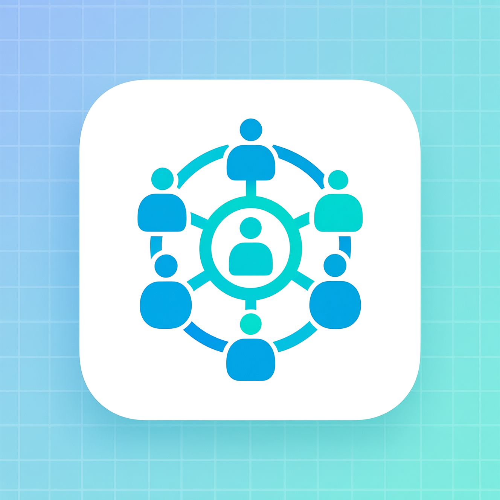

# Módulo Hospital para Odoo

## Descripción

El módulo **Hospital** es un módulo vertical para Odoo (Community y Enterprise) que permite gestionar:

- Pacientes  
- Tratamientos  
- Foro interno para comunicación entre usuarios  

Está diseñado para hospitales, clínicas y centros de salud, integrándose con Odoo de manera sencilla.

---

## Características

- Gestión de **Pacientes**: agregar, editar y listar pacientes.  
- Gestión de **Tratamientos**: asociar tratamientos a pacientes.  
- **Foro interno**: crear temas y comentarios para comunicación interna.  
- Compatible con **Odoo Community y Enterprise**.  
- Menú organizado bajo la categoría **Hospital**.  

---

